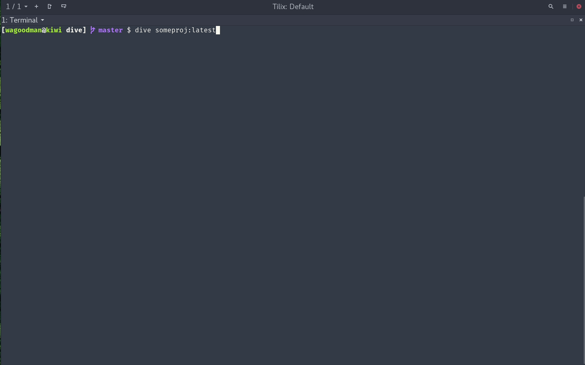

# dive
[](https://goreportcard.com/report/github.com/wagoodman/dive)
[](https://travis-ci.org/wagoodman/dive)

**A tool for exploring a docker image, layer contents, and discovering ways to shrink your Docker image size.**



To analyze a Docker image simply run dive with an image tag/id/digest:
```bash
dive <your-image-tag>
```

or if you want to build your image then jump straight into analyzing it:
```bash
dive build -t <some-tag> .
```

**This is beta quality!** *Feel free to submit an issue if you want a new feature or find a bug :)*

## Basic Features

**Show Docker image contents broken down by layer**

As you select a layer on the left, you are shown the contents of that layer
combined with all previous layers on the right. Also, you can fully explore the
file tree with the arrow keys.

**Indicate what's changed in each layer**

Files that have changed, been modified, added, or removed are indicated in the
file tree. This can be adjusted to show changes for a specific layer, or
aggregated changes up to this layer.

**Estimate "image efficiency"**

The lower left pane shows basic layer info and an experimental metric that will
guess how much wasted space your image contains. This might be from duplicating
files across layers, moving files across layers, or not fully removing files.
Both a percentage "score" and total wasted file space is provided.

**Quick build/analysis cycles**

You can build a Docker image and do an immediate analysis with one command:
`dive build -t some-tag .`

You only need to replace your `docker build` command with the same `dive build`
command.


## Installation

**Ubuntu/Debian**
```bash
wget https://github.com/wagoodman/dive/releases/download/v0.5.0/dive_0.5.0_linux_amd64.deb
sudo apt install ./dive_0.5.0_linux_amd64.deb
```

**RHEL/Centos**
```bash
curl -OL https://github.com/wagoodman/dive/releases/download/v0.5.0/dive_0.5.0_linux_amd64.rpm
rpm -i dive_0.5.0_linux_amd64.rpm
```

**Arch Linux**

Available as [dive](https://aur.archlinux.org/packages/dive/) in the Arch User Repository (AUR).

```bash
yay -S dive
```

The above example assumes [`yay`](https://aur.archlinux.org/packages/yay/) as the tool for installing AUR packages.
*Note*: the AUR repository is **not** controlled by the dive project maintainer. 

**Mac**
```bash
brew tap wagoodman/dive
brew install dive
```
or download the latest Darwin build from the [releases page](https://github.com/wagoodman/dive/releases/download/v0.5.0/dive_0.5.0_darwin_amd64.tar.gz).

**Windows**

Download the [latest release](https://github.com/wagoodman/dive/releases/download/v0.5.0/dive_0.5.0_windows_amd64.zip).

**Go tools**
```bash
go get github.com/wagoodman/dive
```
*Note*: installing in this way you will not see a proper version when running `dive -v`.

**Docker**
```bash
docker pull wagoodman/dive
```

or 

```bash
docker pull quay.io/wagoodman/dive
```

When running you'll need to include the docker client binary and socket file:
```bash
docker run --rm -it \
    -v /var/run/docker.sock:/var/run/docker.sock \
    wagoodman/dive:latest <dive arguments...>
```

Docker for Windows (showing PowerShell compatible line breaks; collapse to a single line for Command Prompt compatibility)
```bash
docker run --rm -it `
    -v /var/run/docker.sock:/var/run/docker.sock `
    wagoodman/dive:latest <dive arguments...>
```

**Note:** depending on the version of docker you are running locally you may need to specify the docker API version as an environment variable:
```bash
   DOCKER_API_VERSION=1.37 dive ...
``` 
or if you are running with a docker image:
```bash
docker run --rm -it \
    -v /var/run/docker.sock:/var/run/docker.sock \
    -e DOCKER_API_VERSION=1.37
    wagoodman/dive:latest <dive arguments...>
```

## KeyBindings

Key Binding                                | Description
-------------------------------------------|---------------------------------------------------------
<kbd>Ctrl + C</kbd>                        | Exit
<kbd>Tab</kbd> or <kbd>Ctrl + Space</kbd>  | Switch between the layer and filetree views
<kbd>Ctrl + F</kbd>                        | Filter files
<kbd>Ctrl + A</kbd>                        | Layer view: see aggregated image modifications
<kbd>Ctrl + L</kbd>                        | Layer view: see current layer modifications
<kbd>Space</kbd>                           | Filetree view: collapse/uncollapse a directory
<kbd>Ctrl + A</kbd>                        | Filetree view: show/hide added files
<kbd>Ctrl + R</kbd>                        | Filetree view: show/hide removed files
<kbd>Ctrl + M</kbd>                        | Filetree view: show/hide modified files
<kbd>Ctrl + U</kbd>                        | Filetree view: show/hide unmodified files
<kbd>PageUp</kbd>                          | Filetree view: scroll up a page
<kbd>PageDown</kbd>                        | Filetree view: scroll down a page

## Configuration

No configuration is necessary, however, you can create a config file and override values:
```yaml
log:
  enabled: true
  path: ./dive.log
  level: info

# Note: you can specify multiple bindings by separating values with a comma.
# Note: UI hinting is derived from the first binding
keybinding:
  # Global bindings
  quit: ctrl+c
  toggle-view: tab, ctrl+space
  filter-files: ctrl+f, ctrl+slash

  # Layer view specific bindings  
  compare-all: ctrl+a
  compare-layer: ctrl+l

  # File view specific bindings
  toggle-collapse-dir: space
  toggle-added-files: ctrl+a
  toggle-removed-files: ctrl+r
  toggle-modified-files: ctrl+m
  toggle-unmodified-files: ctrl+u
  page-up: pgup
  page-down: pgdn
  
diff:
  # You can change the default files show in the filetree (right pane). All diff types are shown by default. 
  hide:
    - added
    - removed
    - changed
    - unchanged

filetree:
  # The default directory-collapse state
  collapse-dir: false

  # The percentage of screen width the filetree should take on the screen (must be >0 and <1)
  pane-width: 0.5

layer:
  # Enable showing all changes from this layer and ever previous layer
  show-aggregated-changes: false

```

dive will search for configs in the following locations:
- `~/.dive.yaml`
- `$XDG_CONFIG_HOME/dive.yaml`
- `~/.config/dive.yaml`
